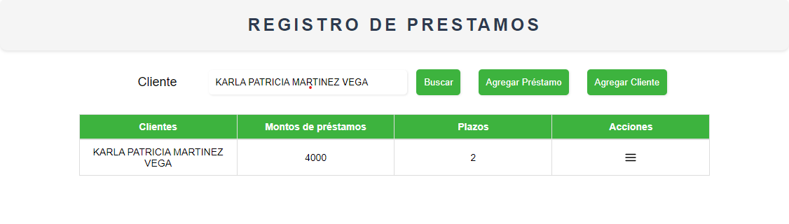

  

<h1 align="center">SISTEMA DE PRESTAMOS</h1>

---

## Tabla de contenido

- [Descripción](#description)
- [Funcionalidades](#functions)
- [Tecnologías Utilizadas](#tecn_need)
- [Instalación](#install)
- [Contribuciones](#constibutting)
- [Licencia](#license)

## Descripción 

Este proyecto es una página web que funciona como sistema de préstamos. Fue desarrollado como parte de una entrevista técnica utilizando tecnologías como JavaScript, PHP, HTML y CSS.

## Funcionalidades 

- Los usuarios pueden solicitar préstamos
- Los administradores pueden aprobar o rechazar solicitudes de préstamos
- Los administradores pueden ver un registro de préstamos aprobados y rechazados
- Los usuarios pueden ver el estado de sus solicitudes de préstamo

## Tecnologías Utilizadas 

- HTML
- CSS
- JavaScript
- PHP

## Instalación 

1. Clonar este repositorio en tu máquina local.
2. Configura tus credenciales de base de datos en el archivo `config.php`.
3. Importa el archivo `database.sql` en tu servidor de base de datos.
4. Inicia el servidor web y accede a la página.

## Contribuciones 

Las contribuciones son bienvenidas. Si deseas contribuir, por favor realiza un fork de este repositorio y envía tus cambios mediante un pull request.

## Licencias 

Este proyecto está bajo la Licencia [MIT](https://opensource.org/licenses/MIT).

